## `> whoami`

Developer working across web, software, automation, and AI. I started in networking and systems, which shaped how I build; I like understanding what happens underneath the tools I use.

Right now I'm focused on **local AI**: running open-source models on my own hardware, building agents, and wiring them into real workflows.

## `> now`

- Building a personal local-first AI setup for models, agents, and coding workflows
- Writing Python apps on top of it
- Running [VegaVortex Digital](https://github.com/vegavortexdigital), a creative agency for custom web development, SEO, and online visibility, working with clients internationally

## `> stack`

**Build:** Python · JavaScript · React · Next.js · Node.js · SQL · MongoDB  
**Infrastructure:** Linux · Docker · Azure · Cloudflare · DNS · SSL/TLS · WordPress  
**AI & automation:** Ollama · LM Studio · n8n · agents · quantization  
**Growth:** Technical SEO · Google Ads · Analytics · Search Console  
**Design & motion:** Figma · GSAP

## `> off_the_clock`

Linux, Hackintosh, virtualization, and emulation; I like taking things apart to see what they can do. Away from the screen: podcasts and reading.

## `> contact`

[a.shaef@vegavortex.com](mailto:a.shaef@vegavortex.com)

 

<code>build · experiment · understand · repeat</code>

